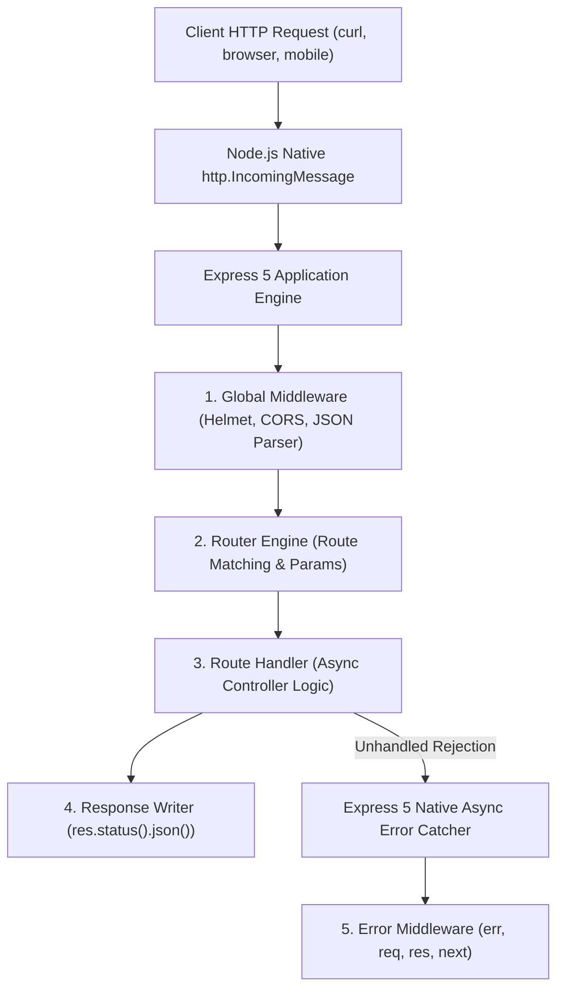
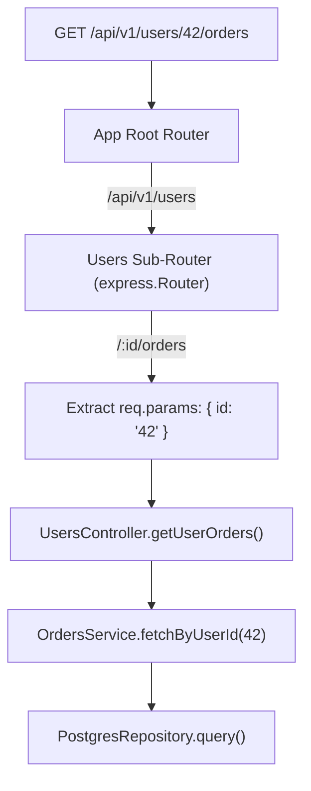
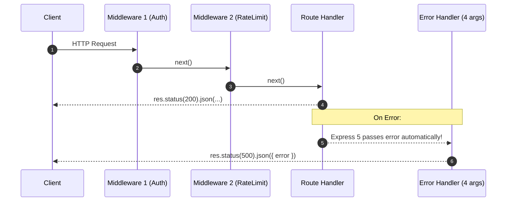

# Learn Express.js 🚀

<div align="center">

[](https://opensource.org/licenses/MIT)
[](https://github.com/manthanank/learn-expressjs/actions/workflows/docker.yml)
[](https://github.com/manthanank/learn-expressjs/actions/workflows/releases.yml)
[](https://expressjs.com/)
[](https://www.typescriptlang.org/)
[](https://nodejs.org/)
[](https://vitest.dev/)

**An exhaustive, production-grade masterclass from absolute zero to staff-level backend systems engineering.**  
Master Express.js 5 breaking changes, native asynchronous error handling, modular routing engines, Russian Doll middleware chains, enterprise security hardening, PostgreSQL / Prisma ORMs, distributed Redis caching, and microservices architecture.

[Getting Started](#-getting-started) • [Express 5 Features](#1-stage-1-absolute-beginner-foundations--express-5-architecture) • [Routing Mastery](#2-stage-2-routing-trie-parameters--controller-architecture) • [Middleware Pipeline](#3-stage-3-the-middleware-pipeline--request-processing-engine) • [Security](#4-stage-4-production-security-hardening-cors--validation) • [Databases & Caching](#5-stage-5-enterprise-database-orm--distributed-caching) • [Interview Prep](#7-stage-7-staff-backend-interview-handbook--production-cheatsheet)

<br/>

<a href="https://www.buymeacoffee.com/manthanank">
  
</a>

</div>

---

## 🗺️ 7-Stage Pedagogical Roadmap


| Stage | Focus Domain | Core Concepts & Engineering Outcomes |
| :--- | :--- | :--- |
| **Stage 1** | **Absolute Beginner Foundations** | HTTP request-response cycle, Express 5 vs 4 breaking changes, native async error handling, project architecture. |
| **Stage 2** | **Routing & Clean Architecture** | Route parameters, path-to-regexp v6 engine, sub-routers, Controller-Service-Repository 3-tier pattern. |
| **Stage 3** | **Middleware Pipeline & Data** | Russian Doll middleware chain, control flow with `next()`, JSON body streaming, file uploads with Multer. |
| **Stage 4** | **Security Hardening & Validation** | Helmet CSP headers, strict CORS, Redis token bucket rate limiting, Zod schema validation, CSRF/XSS defense. |
| **Stage 5** | **Databases, ORM & Caching** | Connection pooling (PostgreSQL/pg), Prisma / Drizzle type-safe queries, Redis cache-aside & cache stampede mitigation. |
| **Stage 6** | **Realtime & Observability** | Server-Sent Events (SSE), WebSocket upgrades, structured JSON logging with Pino, Prometheus metrics, Graceful Shutdown. |
| **Stage 7** | **Staff Backend Interview Handbook** | Node.js single-threaded event loop mechanics, clustering, memory leaks, 30+ staff-level interview Q&As, cheat sheet. |

---


## 📋 Table of Contents

1. [Introduction & Philosophy](#-introduction--philosophy)
   - [What is Express.js?](#what-is-expressjs)
   - [Why Express.js in 2026?](#why-expressjs-in-2026)
   - [Ecosystem & Runtime Landscape (Node.js, Bun, Deno)](#ecosystem--runtime-landscape)
2. [Express 5 vs Express 4: Breaking Changes & Modern Features](#-express-5-vs-express-4)
   - [Native Promise & Async/Await Error Handling](#native-promise--asyncawait-error-handling)
   - [New Path-to-RegExp Engine (v6.x Changes & Wildcards)](#new-path-to-regexp-engine)
   - [Removed & Deprecated APIs](#removed--deprecated-apis)
   - [Query Parser & Body Handling Improvements](#query-parser--body-handling-improvements)
   - [Step-by-Step Migration Guide](#step-by-step-migration-guide)
3. [Getting Started & Project Setup](#-getting-started)
   - [Prerequisites](#prerequisites)
   - [Quick Start Installation](#quick-start-installation)
   - [Directory Structure & Architecture](#directory-structure)
   - [Scripts & Development Workflow](#scripts--development-workflow)
4. [Core Architecture & Middleware Pipeline](#-core-architecture--middleware-pipeline)
   - [The HTTP Request-Response Lifecycle](#the-http-request-response-lifecycle)
   - [How Middleware Works: The Russian Doll Pattern](#how-middleware-works-the-russian-doll-pattern)
   - [Types of Middleware (Application, Router, Built-in, Third-Party, Error)](#types-of-middleware)
   - [Writing Custom Middleware](#writing-custom-middleware)
   - [Control Flow: next(), next('route'), next('router'), next(err)](#control-flow-with-next)
5. [Routing Mastery](#-routing-mastery)
   - [Route Methods & Route Paths](#route-methods--route-paths)
   - [Route Parameters & Query Strings](#route-parameters--query-strings)
   - [Chained Handlers & Middleware Arrays](#chained-handlers--middleware-arrays)
   - [Modular Routing with express.Router()](#modular-routing-with-expressrouter)
   - [Nested Routers & Sub-Applications](#nested-routers--sub-applications)
   - [The Controller-Service-Repository Pattern](#the-controller-service-repository-pattern)
6. [Request Processing & Data Handling](#-request-processing--data-handling)
   - [Parsing JSON, URL-Encoded, Raw, and Text Bodies](#parsing-request-bodies)
   - [Multipart Form Data & File Uploads (Multer, Busboy)](#multipart-form-data--file-uploads)
   - [Content Negotiation (req.accepts, req.format)](#content-negotiation)
   - [Response Helpers (res.json, res.send, res.sendFile, res.download, res.redirect)](#response-helpers)
   - [Streaming Responses & Server-Sent Events (SSE)](#streaming-responses--server-sent-events)
   - [Cookies & Sessions (cookie-parser, express-session)](#cookies--sessions)
7. [Production Security Hardening](#-production-security-hardening)
   - [HTTP Headers with Helmet (CSP, HSTS, X-Frame-Options)](#http-headers-with-helmet)
   - [Cross-Origin Resource Sharing (CORS) Configuration](#cross-origin-resource-sharing-cors)
   - [Rate Limiting & Brute-Force Protection (express-rate-limit, Redis store)](#rate-limiting--brute-force-protection)
   - [Request Validation & Sanitization (Zod, Joi, express-validator)](#request-validation--sanitization)
   - [Preventing SQL/NoSQL Injection, XSS, CSRF, and Parameter Pollution](#preventing-common-vulnerabilities)
   - [Reverse Proxy & Trust Proxy Setup (Nginx, AWS ALB, Cloudflare)](#reverse-proxy--trust-proxy-setup)
8. [Authentication, Authorization & Identity](#-authentication-authorization--identity)
   - [Password Hashing with Argon2 and bcrypt](#password-hashing)
   - [JSON Web Tokens (JWT) Implementation (Access + Refresh Token Rotation)](#json-web-tokens-jwt)
   - [Passport.js Integration (Local, Google, GitHub OAuth2)](#passportjs-integration)
   - [Role-Based Access Control (RBAC) & Permission Middleware](#role-based-access-control-rbac)
   - [Session Store with Redis](#session-store-with-redis)
9. [Database & ORM Integration](#-database--orm-integration)
   - [PostgreSQL & Prisma ORM](#postgresql--prisma-orm)
   - [PostgreSQL with Drizzle ORM](#postgresql-with-drizzle-orm)
   - [MongoDB with Mongoose ODM](#mongodb-with-mongoose-odm)
   - [Redis Caching, Invalidation & Key-Value Operations](#redis-caching--invalidation)
   - [Database Connection Pooling & Graceful Shutdown](#connection-pooling--graceful-shutdown)
10. [Observability, Logging & Error Management](#-observability-logging--error-management)
    - [Centralized Error Handling Architecture](#centralized-error-handling)
    - [Structured Logging with Pino & Winston](#structured-logging-with-pino--winston)
    - [HTTP Request Logging with Morgan](#http-request-logging-with-morgan)
    - [OpenTelemetry & Prometheus Metrics Collection](#opentelemetry--prometheus-metrics)
    - [Health Checks & Kubernetes Probes (/healthz, /readyz)](#health-checks--kubernetes-probes)
11. [Real-Time Communication & WebSockets](#-real-time-communication--websockets)
    - [Socket.io Integration with Express](#socketio-integration)
    - [Lightweight WebSockets with ws](#lightweight-websockets-with-ws)
    - [Event-Driven Architecture with EventEmitter](#event-driven-architecture)
12. [Testing Strategies](#-testing-strategies)
    - [Unit Testing Route Controllers & Services (Vitest)](#unit-testing)
    - [Integration Testing Endpoints (Supertest + Vitest)](#integration-testing-with-supertest)
    - [Mocking External Services & Databases](#mocking-external-services)
    - [Test Coverage & CI Integration](#test-coverage)
13. [Deployment, DevOps & Containerization](#-deployment-devops--containerization)
    - [Optimized Multi-Stage Docker Build](#docker-containerization)
    - [PM2 Cluster Mode & Zero-Downtime Reloads](#pm2-process-management)
    - [Graceful Shutdown Signals (SIGTERM, SIGINT)](#graceful-shutdown)
    - [GitHub Actions CI/CD Pipeline](#github-actions-cicd)
14. [Real-World Project Blueprints](#-real-world-project-blueprints)
    - [Blueprint 1: Production REST API Microservice (Clean Architecture)](#blueprint-1-production-rest-api)
    - [Blueprint 2: High-Throughput Webhook Ingestion Service](#blueprint-2-high-throughput-webhook-ingestion)
15. [Express.js Interview Questions & Answers](#-expressjs-interview-questions--answers)
    - [Beginner Questions (1-10)](#beginner-questions)
    - [Intermediate Questions (11-25)](#intermediate-questions)
    - [Senior & Architectural Questions (26-40)](#senior--architectural-questions)
16. [Comprehensive Cheat Sheet](#-comprehensive-cheat-sheet)
    - [Express 5 Quick Syntax Reference](#express-5-quick-syntax-reference)
    - [HTTP Status Codes Reference](#http-status-codes-reference)
17. [Community & Contributing](#-community--contributing)
18. [Author & Sponsorship](#-author--sponsorship)

---

## 1. Stage 1: Absolute Beginner Foundations & Express 5 Architecture

### 1.1 Introduction & Philosophy

### What is Express.js?

**Express.js** is the de facto standard backend web framework for Node.js. Conceived by TJ Holowaychuk in 2010 and maintained under the stewardship of the OpenJS Foundation, Express provides a minimalist, unopinionated, yet infinitely extensible foundation for building HTTP servers, RESTful APIs, GraphQL gateways, and full-stack web applications.

Unlike monolithic frameworks that impose rigid conventions (such as NestJS or Ruby on Rails), Express operates on a simple design model: **everything is a pipeline of functions that transform the incoming Request (`req`) and assemble the outgoing Response (`res`)**.

```
[ Incoming HTTP Request ]
          │
          ▼
   ┌──────────────┐
   │  cors()      │ ── Allowed Origins Verified
   └──────┬───────┘
          ▼
   ┌──────────────┐
   │ helmet()     │ ── Security Headers Injected
   └──────┬───────┘
          ▼
   ┌──────────────┐
   │ json()       │ ── Request Body Parsed into req.body
   └──────┬───────┘
          ▼
   ┌──────────────┐
   │ authGuard()  │ ── JWT / Session Verified, req.user Attached
   └──────┬───────┘
          ▼
   ┌──────────────┐
   │ Route Handler│ ── Business Logic Executed (Controller/Service)
   └──────┬───────┘
          ▼
[ Outgoing HTTP Response (JSON / Stream / HTML) ]
```

### Why Express.js in 2026?

1. **Unrivaled Ecosystem Maturity**: With over 30 million weekly npm downloads, virtually every database, caching layer, cloud provider, authentication provider, and analytics tool ships with first-class Express middleware.
2. **Express 5 Arrival**: Express 5 natively addresses the longest-standing developer friction points: async/await rejection errors are handled automatically without boilerplate wrapper functions, and path matching has been modernized to standard regex engines.
3. **Exceptional Low-Level Control**: When developing high-throughput microservices, edge proxies, or customized gateway layers, you have absolute control over every byte streamed and every header transmitted.
4. **TypeScript Synergy**: With TypeScript 5+ and modern type definitions (`@types/express`), Express yields complete compile-time type safety across route params, query strings, request bodies, and response payloads.
5. **Runtime Interoperability**: Express 5 runs seamlessly across Node.js 20+, Node.js 22 LTS, Bun, and containerized Linux environments without code changes.

### Ecosystem & Runtime Landscape

| Feature | Express 5 | Fastify | NestJS | Hono | Koa |
| :--- | :--- | :--- | :--- | :--- | :--- |
| **Paradigm** | Unopinionated Minimalist | Schema-Driven Minimalist | Opinionated Angular-like | Web Standard Edge | Middleware Kernel |
| **Weekly Downloads** | ~32,000,000 | ~6,000,000 | ~4,500,000 | ~1,200,000 | ~1,800,000 |
| **Async Support** | Native in v5 | Native | Native | Native | Native |
| **Middleware Model** | Linear `next()` chain | Lifecycle hooks | Modules / Interceptors | Web Standards Fetch API | Cascading `await next()` |
| **TypeScript** | First-class via `@types` | First-class | Built natively in TS | Built natively in TS | First-class via `@types` |
| **Community Support**| Largest on Earth | Rapidly growing | Massive in enterprise | Growing in Edge/Serverless | Stable legacy |

---

### 1.2 Express 5 vs Express 4 Deep Dive


### Line-by-Line Code Breakdown: Express 5 Core Setup

| Statement / Line | Architectural Component | Pedagogical Runtime Purpose |
| :--- | :--- | :--- |
| `import express from 'express'` | **Framework Factory** | Imports the factory function. In Express 5, `express()` initializes a new `Application` prototype backed by an internal router. |
| `app.use(helmet())` | **Security Headers** | Injects 15 secure HTTP response headers (CSP, `X-Content-Type-Options: nosniff`, `Strict-Transport-Security`). |
| `app.use(cors(...))` | **CORS Policy** | Validates incoming `Origin` headers against allowed domains and answers preflight `OPTIONS` requests. |
| `app.use(express.json({ limit: '1mb' }))` | **Body Stream Parser** | Buffers raw TCP socket bytes up to 1 MB, parses them via `JSON.parse()`, and assigns the resulting JavaScript object to `req.body`. |
| `app.get('/health', ...)` | **Health Probe** | Exposes an instant diagnostic route for Docker, AWS ALB, and Kubernetes readiness/liveness checks. |
| `app.use((err, req, res, next) => ...)` | **Error Handler** | 4-argument signature: Express uses `fn.length === 4` reflection to register error handlers, bypassing standard routes when an error occurs. |


Express 5.0 represents the first major release of Express in a decade. It modernizes the framework to match ECMAScript 2022+ patterns while shedding antiquated Node.js 0.10 legacies.

### Native Promise & Async/Await Error Handling

In Express 4, if an `async` route handler rejected or threw an unhandled error inside a promise, the request would hang until client timeout unless explicitly wrapped in `try/catch` or an `express-async-errors` monkeypatch:

```typescript
// ❌ EXPRESS 4: Boilerplate try/catch or wrapper required
app.get('/users/:id', async (req, res, next) => {
  try {
    const user = await database.findUser(req.params.id);
    if (!user) return res.status(404).json({ error: 'Not found' });
    res.json(user);
  } catch (err) {
    next(err); // Mandatory in Express 4, otherwise hangs indefinitely!
  }
});
```

In Express 5, route handlers and middleware returning a Promise that rejects automatically pass the error to `next(err)`:

```typescript
// ✅ EXPRESS 5: Native promise rejection handling!
app.get('/users/:id', async (req, res) => {
  // If database.findUser rejects or throws, Express 5 automatically routes to your error middleware
  const user = await database.findUser(req.params.id);
  if (!user) {
    throw new NotFoundError(`User ${req.params.id} does not exist`);
  }
  res.json({ success: true, data: user });
});
```

### New Path-to-RegExp Engine

Express 5 upgrades `path-to-regexp` from version 0.1.x to 6.x. This brings route syntax closer to modern URLPattern standards with a few breaking differences:

1. **Wildcard `*` Syntax**:
   - Express 4: `app.get('/files/*', handler)`
   - Express 5: `app.get('/files/{*splat}', handler)` or `app.get('/files/(.*)', handler)`
2. **Optional Parameters**:
   - Express 4: `app.get('/user/:id?', handler)`
   - Express 5: `app.get('/user{/:id}?', handler)`
3. **Regular Expressions in Parameters**:
   - Express 4: `app.get('/user/:id(\d+)', handler)`
   - Express 5: Parameters using custom regex must use parentheses: `app.get('/user/:id(\d+)', handler)` or explicit regex routes.

### Removed & Deprecated APIs

Express 5 cleans up legacy functions that have been deprecated for years:

| Removed / Altered Method | Express 4 | Express 5 Replacement |
| :--- | :--- | :--- |
| `res.send(status, body)` | `res.send(404, 'Not Found')` | `res.status(404).send('Not Found')` |
| `res.json(status, obj)` | `res.json(500, { error: 'Failed' })`| `res.status(500).json({ error: 'Failed' })` |
| `app.del()` | `app.del('/item', handler)` | `app.delete('/item', handler)` |
| `app.param(fn)` | Global param logic interception | Use regular middleware or router-scoped `app.param('id', fn)` |
| `req.param(name)` | `req.param('id')` | Explicit `req.params.id`, `req.query.id`, or `req.body.id` |
| `res.sendfile()` | Case sensitive typo helper | `res.sendFile()` (capital F) |
| `req.host` | Returned host + port | `req.hostname` (host without port) or `req.host` (IPv6 compliant) |

### Query Parser & Body Handling Improvements

- **Query Parser**: Express 5 defaults to the `simple` query parser (using Node's built-in `querystring` module). If you require nested objects like `?user[name]=Alex&user[age]=30`, you must explicitly configure the `extended` parser:
  ```typescript
  app.set('query parser', 'extended'); // Uses 'qs' module under the hood
  ```
- **MIME Type Handling**: Improved `res.type()` matching using modern mime-db definitions.
- **Node.js Requirement**: Requires Node.js 18 or higher (Node.js 20 / 22 LTS recommended).

### Step-by-Step Migration Guide

1. Update `package.json`:
   ```json
   {
     "dependencies": {
       "express": "^5.0.1"
     },
     "devDependencies": {
       "@types/express": "^5.0.0"
     }
   }
   ```
2. Remove third-party async-wrap libraries:
   - Uninstall `express-async-errors` or custom `asyncHandler` wrappers.
3. Replace all status-first sends:
   - Search for `res.send(200, ...)` -> `res.status(200).send(...)`
   - Search for `res.json(400, ...)` -> `res.status(400).json(...)`
4. Inspect wildcards in route paths:
   - Update `app.use('/api/*', ...)` to `app.use('/api/(.*)', ...)`.


### 1.3 Getting Started & Project Setup


#

## 2. Stage 2: Routing Trie, Parameters & Controller Architecture




Routing determines how an application responds to a client request to a particular endpoint (URI path and HTTP method).

#

## 3. Stage 3: The Middleware Pipeline & Request Processing Engine




#

### 3.4 Request Processing, Streaming & Data Handling


#

## 4. Stage 4: Production Security Hardening, CORS & Validation

In production environments, unhardened Express applications are susceptible to common OWASP vulnerabilities: Cross-Site Scripting (XSS), Cross-Site Request Forgery (CSRF), SQL/NoSQL Injection, and Denial of Service (DoS).

### HTTP Headers with Helmet

`helmet` automates the configuration of secure HTTP response headers:

```typescript
import helmet from 'helmet';
import express from 'express';

const app = express();

app.use(
  helmet({
    // Content Security Policy restricts where scripts/styles/media can load from
    contentSecurityPolicy: {
      directives: {
        defaultSrc: ["'self'"],
        scriptSrc: ["'self'", "'trusted-cdn.com'"],
        styleSrc: ["'self'", "'fonts.googleapis.com'"],
        fontSrc: ["'self'", "'fonts.gstatic.com'"],
        imgSrc: ["'self'", 'data:', 'https://images.unsplash.com'],
        upgradeInsecureRequests: []
      }
    },
    // Enforce HTTPS transmission for 1 year with preloading
    hsts: {
      maxAge: 31536000,
      includeSubDomains: true,
      preload: true
    },
    // Prevent MIME-type sniffing
    noSniff: true,
    // Disallow clickjacking framing
    frameguard: { action: 'deny' },
    // Remove X-Powered-By: Express header
    hidePoweredBy: true
  })
);
```

### Cross-Origin Resource Sharing (CORS)

Configure CORS to permit requests exclusively from trusted client domains:

```typescript
import cors, { CorsOptions } from 'cors';

const allowedOrigins = [
  'https://yourdomain.com',
  'https://admin.yourdomain.com',
  process.env.NODE_ENV === 'development' ? 'http://localhost:5173' : ''
].filter(Boolean);

const corsOptions: CorsOptions = {
  origin: (origin, callback) => {
    // Allow non-browser requests (Postman, server-to-server) or valid origins
    if (!origin || allowedOrigins.includes(origin)) {
      callback(null, true);
    } else {
      callback(new Error('Blocked by CORS policy: Origin not allowed'));
    }
  },
  methods: ['GET', 'POST', 'PUT', 'PATCH', 'DELETE', 'OPTIONS'],
  allowedHeaders: ['Content-Type', 'Authorization', 'X-Correlation-Id'],
  credentials: true, // Allow cookies across origins
  maxAge: 86400 // Preflight cache in seconds
};

app.use(cors(corsOptions));
```

### Rate Limiting & Brute-Force Protection

Protect login and public endpoints against brute force and DDoS attacks:

```typescript
import rateLimit from 'express-rate-limit';

// Global API rate limiter
export const globalLimiter = rateLimit({
  windowMs: 15 * 60 * 1000, // 15 minutes
  max: 100, // Limit each IP to 100 requests per windowMs
  standardHeaders: true, // Return RateLimit headers in the response
  legacyHeaders: false,
  message: {
    success: false,
    message: 'Too many requests from this IP, please try again after 15 minutes.'
  }
});

// Sensitive Auth endpoint limiter (Brute-force protection)
export const authLimiter = rateLimit({
  windowMs: 60 * 60 * 1000, // 1 hour
  max: 5, // Maximum 5 failed attempts per hour
  skipSuccessfulRequests: true,
  message: {
    success: false,
    message: 'Too many failed login attempts. Account temporarily locked for 1 hour.'
  }
});

app.use('/api/', globalLimiter);
app.use('/api/auth/login', authLimiter);
```

### Request Validation & Sanitization with Zod

Never trust incoming user input. Use **Zod** to validate types and sanitize inputs at runtime:

```typescript
import { z } from 'zod';
import { Request, Response, NextFunction } from 'express';

// 1. Define schema
export const RegisterUserSchema = z.object({
  body: z.object({
    email: z.string().email('Invalid email address').toLowerCase().trim(),
    password: z
      .string()
      .min(8, 'Password must be at least 8 characters')
      .regex(/[A-Z]/, 'Must contain at least one uppercase letter')
      .regex(/[0-9]/, 'Must contain at least one digit'),
    name: z.string().min(2).max(50).trim()
  })
});

// 2. Generic Validation Middleware
export const validate = (schema: z.AnyZodObject) => {
  return async (req: Request, res: Response, next: NextFunction) => {
    try {
      await schema.parseAsync({
        body: req.body,
        query: req.query,
        params: req.params
      });
      next();
    } catch (error) {
      if (error instanceof z.ZodError) {
        return res.status(400).json({
          success: false,
          errors: error.errors.map((e) => ({
            field: e.path.join('.').replace(/^body\./, ''),
            message: e.message
          }))
        });
      }
      next(error);
    }
  };
};

// 3. Attach to route
app.post('/api/auth/register', validate(RegisterUserSchema), async (req, res) => {
  // Guaranteed valid and sanitized
  res.status(201).json({ success: true, message: 'User created' });
});
```

### Reverse Proxy & Trust Proxy Setup

When deploying behind reverse proxies like AWS ALB, Nginx, or Cloudflare, Express sees the proxy's IP address rather than the client's real IP unless `trust proxy` is enabled:

```typescript
// Enable proxy trust to read X-Forwarded-For headers
app.set('trust proxy', 1); // Trust the first upstream hop (e.g. AWS ALB)

// Or specify loopback / subnet
// app.set('trust proxy', 'loopback, 10.0.0.0/8');
```

---

## 🔐 Authentication, Authorization & Identity

### Password Hashing with Argon2

Argon2 is the winner of the Password Hashing Competition and the current gold standard for credential security, surpassing bcrypt:

```typescript
import argon2 from 'argon2';

export class PasswordService {
  static async hash(password: string): Promise<string> {
    return argon2.hash(password, {
      type: argon2.argon2id,
      memoryCost: 2 ** 16, // 64 MB
      timeCost: 3,
      parallelism: 1
    });
  }

  static async verify(hash: string, plainText: string): Promise<boolean> {
    return argon2.verify(hash, plainText);
  }
}
```

### JSON Web Tokens (JWT) Implementation with Refresh Token Rotation

An enterprise-grade JWT architecture requires two tokens:
1. **Short-lived Access Token** (e.g., 15 minutes) sent in Authorization header.
2. **Long-lived Refresh Token** (e.g., 7 days) stored in an `httpOnly`, `secure`, `sameSite: 'strict'` cookie.

```typescript
import jwt from 'jsonwebtoken';
import { Request, Response, NextFunction } from 'express';

const ACCESS_SECRET = process.env.JWT_ACCESS_SECRET || 'access_super_secret_key';
const REFRESH_SECRET = process.env.JWT_REFRESH_SECRET || 'refresh_super_secret_key';

export interface TokenPayload {
  userId: string;
  role: 'USER' | 'ADMIN' | 'MANAGER';
}

export class TokenService {
  static generateTokens(payload: TokenPayload) {
    const accessToken = jwt.sign(payload, ACCESS_SECRET, { expiresIn: '15m' });
    const refreshToken = jwt.sign(payload, REFRESH_SECRET, { expiresIn: '7d' });
    return { accessToken, refreshToken };
  }

  static verifyAccessToken(token: string): TokenPayload {
    return jwt.verify(token, ACCESS_SECRET) as TokenPayload;
  }

  static verifyRefreshToken(token: string): TokenPayload {
    return jwt.verify(token, REFRESH_SECRET) as TokenPayload;
  }
}

// Authentication Guard Middleware
export const authenticate = (req: Request, res: Response, next: NextFunction) => {
  const authHeader = req.headers.authorization;
  if (!authHeader || !authHeader.startsWith('Bearer ')) {
    return res.status(401).json({ success: false, message: 'Authentication required' });
  }

  const token = authHeader.split(' ')[1];
  try {
    const payload = TokenService.verifyAccessToken(token);
    (req as any).user = payload;
    next();
  } catch (err) {
    return res.status(401).json({ success: false, message: 'Invalid or expired access token' });
  }
};
```

### Role-Based Access Control (RBAC) Middleware

Enforce authorization gates based on user roles and permissions:

```typescript
type Role = 'USER' | 'ADMIN' | 'MANAGER';

export const authorize = (allowedRoles: Role[]) => {
  return (req: Request, res: Response, next: NextFunction) => {
    const user = (req as any).user;
    if (!user) {
      return res.status(401).json({ success: false, message: 'Authentication required' });
    }

    if (!allowedRoles.includes(user.role)) {
      return res.status(403).json({
        success: false,
        message: `Forbidden: Requires one of [${allowedRoles.join(', ')}] permissions`
      });
    }

    next();
  };
};

// Route usage
app.delete('/api/users/:id', authenticate, authorize(['ADMIN']), async (req, res) => {
  res.json({ message: 'User deleted by Administrator' });
});
```


## 5. Stage 5: Enterprise Database, ORM & Distributed Caching

### PostgreSQL & Prisma ORM

Prisma provides type-safe query generation, schema migrations, and intuitive relations:

```prisma
// prisma/schema.prisma
datasource db {
  provider = "postgresql"
  url      = env("DATABASE_URL")
}

generator client {
  provider = "prisma-client-js"
}

model User {
  id        String   @id @default(uuid())
  email     String   @unique
  name      String?
  posts     Post[]
  createdAt DateTime @default(now())
}

model Post {
  id        String   @id @default(uuid())
  title     String
  content   String?
  published Boolean  @default(false)
  authorId  String
  author    User     @relation(fields: [authorId], references: [id])
}
```

Service Layer Implementation with Prisma:

```typescript
import { PrismaClient } from '@prisma/client';

export const prisma = new PrismaClient({
  log: process.env.NODE_ENV === 'development' ? ['query', 'error', 'warn'] : ['error']
});

export class UserService {
  static async createUser(data: { email: string; name?: string }) {
    return prisma.user.create({
      data,
      select: { id: true, email: true, name: true, createdAt: true }
    });
  }

  static async getUserWithPosts(userId: string) {
    return prisma.user.findUnique({
      where: { id: userId },
      include: {
        posts: {
          where: { published: true }
        }
      }
    });
  }
}
```

### MongoDB with Mongoose ODM

For document-oriented persistence, Mongoose enforces schema validation over MongoDB:

```typescript
import mongoose, { Schema, Document } from 'mongoose';

export interface IUser extends Document {
  email: string;
  name: string;
  roles: string[];
  createdAt: Date;
}

const UserSchema = new Schema<IUser>(
  {
    email: { type: String, required: true, unique: true, index: true, lowercase: true },
    name: { type: String, required: true, trim: true },
    roles: { type: [String], default: ['USER'] }
  },
  { timestamps: true }
);

export const UserModel = mongoose.model<IUser>('User', UserSchema);
```

### Redis Caching & Invalidation Patterns

Caching hot database queries in Redis reduces latency from tens of milliseconds down to sub-millisecond responses (Cache-Aside pattern):

```typescript
import { createClient } from 'redis';

export const redis = createClient({
  url: process.env.REDIS_URL || 'redis://localhost:6337'
});

redis.on('error', (err) => console.error('Redis Client Error', err));
await redis.connect();

export class CacheService {
  static async getOrSet<T>(key: string, ttlSeconds: number, fetchFn: () => Promise<T>): Promise<T> {
    const cached = await redis.get(key);
    if (cached) {
      return JSON.parse(cached) as T;
    }

    const freshData = await fetchFn();
    if (freshData) {
      await redis.set(key, JSON.stringify(freshData), { EX: ttlSeconds });
    }
    return freshData;
  }

  static async invalidate(pattern: string): Promise<void> {
    const keys = await redis.keys(pattern);
    if (keys.length > 0) {
      await redis.del(keys);
    }
  }
}
```

---

## 📊 Observability, Logging & Error Management

### Centralized Error Handling Architecture

Create strongly typed operational error classes that extend JavaScript's base `Error`:

```typescript
// src/errors/AppError.ts
export class AppError extends Error {
  public readonly statusCode: number;
  public readonly isOperational: boolean;

  constructor(message: string, statusCode: number, isOperational = true) {
    super(message);
    this.statusCode = statusCode;
    this.isOperational = isOperational;
    Object.setPrototypeOf(this, new.target.prototype);
    Error.captureStackTrace(this);
  }
}

export class NotFoundError extends AppError {
  constructor(message = 'Resource not found') {
    super(message, 404);
  }
}

export class BadRequestError extends AppError {
  constructor(message = 'Bad request') {
    super(message, 400);
  }
}

export class UnauthorizedError extends AppError {
  constructor(message = 'Unauthorized') {
    super(message, 401);
  }
}
```

Global Error Middleware:

```typescript
// src/middlewares/errorHandler.ts
import { Request, Response, NextFunction } from 'express';
import { AppError } from '../errors/AppError.js';

export const errorHandler = (
  err: Error,
  _req: Request,
  res: Response,
  _next: NextFunction
) => {
  if (err instanceof AppError) {
    return res.status(err.statusCode).json({
      success: false,
      message: err.message
    });
  }

  // Unhandled / Unexpected programming bug
  console.error('🔥 Unexpected Error:', err);
  return res.status(500).json({
    success: false,
    message: process.env.NODE_ENV === 'production' ? 'Internal Server Error' : err.message
  });
};
```

### Structured Logging with Pino

Pino is the fastest JSON logger for Node.js, producing zero-allocation structured JSON suitable for Datadog, ELK, or CloudWatch:

```typescript
import pino from 'pino';
import pinoHttp from 'pino-http';

export const logger = pino({
  level: process.env.LOG_LEVEL || 'info',
  transport:
    process.env.NODE_ENV !== 'production'
      ? { target: 'pino-pretty', options: { colorize: true } }
      : undefined
});

export const httpLogger = pinoHttp({
  logger,
  customLogLevel: (_req, res, err) => {
    if (res.statusCode >= 500 || err) return 'error';
    if (res.statusCode >= 400) return 'warn';
    return 'info';
  }
});
```

### Health Checks & Kubernetes Probes

Container orchestrators (Kubernetes, AWS ECS) require endpoints to evaluate container health:

```typescript
// Liveness Probe: Tells Kubernetes if the container is alive or needs a restart
app.get('/healthz', (_req, res) => {
  res.status(200).json({ status: 'alive' });
});

// Readiness Probe: Tells load balancer if container is ready to accept user traffic
app.get('/readyz', async (_req, res) => {
  try {
    // Check DB connection
    await prisma.$queryRaw`SELECT 1`;
    // Check Redis connection
    await redis.ping();
    res.status(200).json({ status: 'ready', database: 'connected', redis: 'connected' });
  } catch (err: any) {
    res.status(503).json({ status: 'unready', error: err.message });
  }
});
```


## 6. Stage 6: Real-time WebSockets, Testing & Observability Systems

### Socket.io Integration with Express

Attach Socket.io to the underlying HTTP server created from Express:

```typescript
import express from 'express';
import { createServer } from 'http';
import { Server, Socket } from 'socket.io';

const app = express();
const httpServer = createServer(app);

const io = new Server(httpServer, {
  cors: {
    origin: 'http://localhost:5173',
    methods: ['GET', 'POST']
  }
});

// Middleware for Socket Authentication
io.use((socket, next) => {
  const token = socket.handshake.auth.token;
  if (token === 'valid-token') {
    next();
  } else {
    next(new Error('Authentication failed'));
  }
});

io.on('connection', (socket: Socket) => {
  console.log(`⚡ User connected: ${socket.id}`);

  // Join a private room
  socket.on('join_room', (roomId: string) => {
    socket.join(roomId);
    console.log(`Socket ${socket.id} joined room ${roomId}`);
  });

  // Broadcast to room
  socket.on('send_message', ({ roomId, message }) => {
    io.to(roomId).emit('receive_message', {
      sender: socket.id,
      message,
      timestamp: new Date().toISOString()
    });
  });

  socket.on('disconnect', () => {
    console.log(`User disconnected: ${socket.id}`);
  });
});

// Listen on the HTTP Server (NOT app.listen!)
httpServer.listen(3000, () => {
  console.log('Server with WebSockets listening on port 3000');
});
```

### Lightweight WebSockets with ws

When you do not need fallbacks or rooms, the `ws` package is significantly faster and uses less memory:

```typescript
import { WebSocketServer, WebSocket } from 'ws';
import { createServer } from 'http';
import express from 'express';

const app = express();
const server = createServer(app);
const wss = new WebSocketServer({ server, path: '/ws' });

wss.on('connection', (ws: WebSocket) => {
  ws.on('message', (data) => {
    console.log('Received raw message:', data.toString());
    // Echo back
    ws.send(JSON.stringify({ echo: data.toString() }));
  });
});
```

---

## 🧪 Testing Strategies

Testing backend APIs requires two tiers: fast unit tests for business logic, and end-to-end integration tests using `supertest` against real HTTP endpoints.

### Integration Testing with Supertest & Vitest

In Express, decoupling your `app` factory from `server.listen()` allows `supertest` to test endpoints in-memory without binding to actual system network ports:

```typescript
// src/app.test.ts
import { describe, it, expect, beforeEach } from 'vitest';
import request from 'supertest';
import { createApp } from './app.js';

describe('Express 5 API Suite', () => {
  const app = createApp();

  describe('GET /health', () => {
    it('should return 200 OK with server uptime', async () => {
      const res = await request(app).get('/health');
      expect(res.status).toBe(200);
      expect(res.body).toEqual(
        expect.objectContaining({
          status: 'ok',
          version: '1.0.0'
        })
      );
      expect(typeof res.body.uptime).toBe('number');
    });
  });

  describe('POST /api/items', () => {
    it('should validate request body and reject missing title', async () => {
      const res = await request(app)
        .post('/api/items')
        .send({});

      expect(res.status).toBe(400);
      expect(res.body.success).toBe(false);
      expect(res.body.message).toContain('Title is required');
    });

    it('should create an item and return 201 Created', async () => {
      const res = await request(app)
        .post('/api/items')
        .send({ title: 'Learn TypeScript Architecture' });

      expect(res.status).toBe(201);
      expect(res.body.success).toBe(true);
      expect(res.body.data.title).toBe('Learn TypeScript Architecture');
      expect(res.body.data.completed).toBe(false);
    });
  });

  describe('Error Handling Middleware', () => {
    it('should route unhandled promise rejections directly to 500 error handler', async () => {
      const res = await request(app).get('/api/async-error-demo');
      expect(res.status).toBe(500);
      expect(res.body.success).toBe(false);
      expect(res.body.message).toContain('Express 5 natively catches');
    });

    it('should return 404 for nonexistent routes', async () => {
      const res = await request(app).get('/unknown/route/path');
      expect(res.status).toBe(404);
      expect(res.body.success).toBe(false);
      expect(res.body.message).toBe('Endpoint not found');
    });
  });
});
```

### Mocking Services in Unit Tests

```typescript
import { describe, it, expect, vi } from 'vitest';
import { ItemController } from './controllers/item.controller.js';
import { ItemService } from './services/item.service.js';

vi.mock('./services/item.service.js');

describe('ItemController', () => {
  it('calls ItemService.getAll and returns items', async () => {
    const mockItems = [{ id: '1', title: 'Test Item', completed: false }];
    vi.mocked(ItemService.getAll).mockResolvedValue(mockItems as any);

    const req: any = {};
    const res: any = {
      status: vi.fn().mockReturnThis(),
      json: vi.fn()
    };

    await ItemController.getItems(req, res);

    expect(res.status).toHaveBeenCalledWith(200);
    expect(res.json).toHaveBeenCalledWith({ success: true, data: mockItems });
  });
});
```


## 🚢 Deployment, DevOps & Containerization

### Docker Containerization (Multi-Stage Build)

Production Node.js containers must be lean, immutable, and secure (non-root user):

```dockerfile
# Multi-stage production build
# Stage 1: Build stage
FROM node:20-alpine AS builder

WORKDIR /app

COPY package*.json ./
RUN npm ci

COPY tsconfig.json ./
COPY src ./src
RUN npm run build

# Stage 2: Production runtime stage
FROM node:20-alpine AS runner

WORKDIR /app

ENV NODE_ENV=production
ENV PORT=3000

# Security: Run as unprivileged node user
USER node

COPY package*.json ./
RUN npm ci --only=production && npm cache clean --force

# Copy compiled JavaScript from builder stage
COPY --from=builder --chown=node:node /app/dist ./dist
COPY --chown=node:node public ./public

EXPOSE 3000

CMD ["node", "dist/server.js"]
```

Build and run the container locally:

```bash
docker build -t learn-expressjs:latest .
docker run -p 3000:3000 -e NODE_ENV=production learn-expressjs:latest
```

### Graceful Shutdown (SIGTERM & SIGINT)

When deploying to Kubernetes or cloud providers, the orchestrator issues a `SIGTERM` signal before killing containers. Express must stop accepting new requests and wait for in-flight requests to complete before terminating database connections:

```typescript
import { Server } from 'http';
import { prisma } from './config/db.js';
import { redis } from './config/redis.js';

export const setupGracefulShutdown = (server: Server) => {
  const shutdown = async (signal: string) => {
    console.log(`Received ${signal}. Starting graceful shutdown...`);

    // 1. Stop taking new HTTP requests
    server.close(async () => {
      console.log('HTTP server closed. Resolving remaining resources...');

      try {
        // 2. Disconnect database pool
        await prisma.$disconnect();
        console.log('Database connections terminated.');

        // 3. Close Redis connection
        await redis.quit();
        console.log('Redis client disconnected.');

        console.log('Graceful shutdown completed successfully. Exiting process.');
        process.exit(0);
      } catch (err) {
        console.error('Error during shutdown:', err);
        process.exit(1);
      }
    });

    // Force exit if shutdown takes longer than 10 seconds
    setTimeout(() => {
      console.error('Graceful shutdown timed out after 10 seconds! Forcefully terminating.');
      process.exit(1);
    }, 10000);
  };

  process.on('SIGTERM', () => shutdown('SIGTERM'));
  process.on('SIGINT', () => shutdown('SIGINT'));
};
```

### PM2 Process Management & Cluster Mode

To utilize multi-core CPUs in bare-metal or VM deployments without Docker:

```javascript
// ecosystem.config.cjs
module.exports = {
  apps: [
    {
      name: 'express-api',
      script: './dist/server.js',
      instances: 'max', // Scale to all available CPU cores
      exec_mode: 'cluster',
      autorestart: true,
      watch: false,
      max_memory_restart: '1G',
      env_production: {
        NODE_ENV: 'production',
        PORT: 3000
      }
    }
  ]
};
```

Run with:
```bash
pm2 start ecosystem.config.cjs --env production
pm2 status
pm2 logs
```

---

## 🏛️ Real-World Project Blueprints

### Blueprint 1: Production REST API Microservice (Clean Architecture)

A standard production pattern organizing domain features into Controllers, Services, and Data Access Objects:

```
src/
├── modules/
│   ├── auth/
│   │   ├── auth.controller.ts
│   │   ├── auth.service.ts
│   │   ├── auth.validation.ts
│   │   └── auth.routes.ts
│   └── users/
│       ├── user.controller.ts
│       ├── user.service.ts
│       ├── user.repository.ts
│       ├── user.model.ts
│       └── user.routes.ts
├── middlewares/
│   ├── authenticate.ts
│   ├── errorHandler.ts
│   └── rateLimiter.ts
├── config/
│   ├── env.ts
│   └── database.ts
├── app.ts
└── server.ts
```

### Blueprint 2: High-Throughput Webhook Ingestion Service

For receiving webhooks (Stripe, GitHub, Shopify) requiring raw body validation and asynchronous queuing:

```typescript
import express from 'express';
import crypto from 'crypto';

const app = express();

// Capture raw body buffer for signature validation
app.post(
  '/webhooks/stripe',
  express.raw({ type: 'application/json' }),
  (req, res) => {
    const signature = req.headers['stripe-signature'] as string;
    const webhookSecret = process.env.STRIPE_WEBHOOK_SECRET!;

    try {
      // In production: stripe.webhooks.constructEvent(req.body, signature, webhookSecret)
      console.log('Webhook verified successfully');

      // Immediately respond 200 OK to sender before processing to avoid timeouts
      res.status(200).json({ received: true });

      // Enqueue job to background queue (BullMQ / RabbitMQ / SQS)
      // queue.add('process_payment', JSON.parse(req.body.toString()));
    } catch (err: any) {
      console.error('Webhook signature verification failed:', err.message);
      res.status(400).send(`Webhook Error: ${err.message}`);
    }
  }
);
```


## 7. Stage 7: Staff Backend Interview Handbook & Production Cheatsheet

### Beginner Questions

#### 1. What is Express.js, and what is its role in the Node.js ecosystem?
Express.js is a minimalist, unopinionated, flexible web application framework for Node.js. It simplifies HTTP server creation by wrapping Node's core `http` module with a robust routing engine, a middleware processing pipeline, and convenient helpers for request parsing, cookie handling, and response rendering.

#### 2. What is middleware in Express?
Middleware is any function that has access to the Request object (`req`), Response object (`res`), and the `next` function in the application’s request-response cycle. Middleware functions can execute arbitrary code, modify `req` and `res`, terminate the request by sending a response, or call `next()` to pass control to the subsequent middleware.

#### 3. What happens if you do not call `next()` or send a response in a middleware?
The client request will hang indefinitely until the browser, reverse proxy, or HTTP client reaches its connection timeout threshold, leading to a 504 Gateway Timeout or broken socket.

#### 4. How does Express 5 handle asynchronous errors compared to Express 4?
In Express 4, unhandled promise rejections inside `async` route handlers required manual `try/catch` wrapping and explicit `next(err)` calls. In Express 5, route handlers and middleware returning a Promise that rejects automatically pass the rejected error to `next(err)` without any wrappers.

#### 5. What are the 4 arguments that distinguish an error-handling middleware in Express?
`(err, req, res, next)`. Express inspects the function's `length` property (`fn.length === 4`) to identify it as error-handling middleware. Omitting any of the four arguments causes Express to treat it as standard middleware.

#### 6. What is the difference between `app.use()` and `app.get()`?
`app.use()` matches any HTTP method (GET, POST, PUT, DELETE, etc.) starting with the specified path prefix (acting as middleware). `app.get()` matches strictly HTTP `GET` requests for the exact path specified.

#### 7. How do you access URL parameters and query parameters in Express?
URL route parameters defined with colons (e.g. `/users/:id`) are available on `req.params.id`. Query string parameters (e.g. `?search=term&page=1`) are parsed and available on `req.query.search` and `req.query.page`.

#### 8. How do you serve static files in Express?
Using the built-in `express.static` middleware:
```typescript
app.use(express.static('public'));
```

#### 9. What is `cors` and why is it needed in Express APIs?
CORS (Cross-Origin Resource Sharing) is a browser security mechanism that blocks web applications running on one domain (e.g., `http://localhost:5173`) from making HTTP requests to a different backend origin (e.g., `http://localhost:3000`) unless the backend sends explicit HTTP headers (`Access-Control-Allow-Origin`).

#### 10. How do you parse incoming JSON data in Express?
By invoking the built-in JSON body parser before the route handlers:
```typescript
app.use(express.json());
```

---

### Intermediate Questions

#### 11. What is the difference between `next()`, `next('route')`, and `next('router')`?
- `next()` passes control to the next middleware in the current stack.
- `next('route')` only works within route middleware and bypasses all remaining middleware in the current route, jumping to the next route matching the path.
- `next('router')` only works within router instances and skips the rest of that sub-router, returning control back to the parent router stack.

#### 12. How does Express determine the order of middleware execution?
Middleware functions execute in the exact lexical order in which they are registered via `app.use()` or route declarations.

#### 13. What is the difference between `res.send()`, `res.json()`, and `res.end()`?
- `res.send()` is a polymorphic helper that sets appropriate Content-Type headers based on the input type (string, buffer, object).
- `res.json()` explicitly sets `Content-Type: application/json` and serializes JavaScript objects using `JSON.stringify()`, formatting null and undefined safely.
- `res.end()` ends the response process immediately without sending any body payload or setting high-level headers.

#### 14. What are the breaking changes regarding wildcards in Express 5 routing?
Express 5 upgrades `path-to-regexp` to version 6. Plain asterisks like `/files/*` must now be written as `/files/{*splat}` or `/files/(.*)`.

#### 15. How do you implement rate limiting in Express?
By utilizing `express-rate-limit` with an in-memory store for single instances or a Redis store for distributed multi-instance clusters:
```typescript
import rateLimit from 'express-rate-limit';
app.use(rateLimit({ windowMs: 15 * 60 * 1000, max: 100 }));
```

#### 16. How does `cookie-parser` work with signed cookies?
`cookieParser(secret)` signs cookies using HMAC SHA-256. When reading `req.signedCookies`, Express validates that the cookie payload was not tampered with on the client side.

#### 17. How should file uploads be handled in Express?
Express's built-in parsers do not parse `multipart/form-data`. You must use a streaming multipart parser like `multer` or `busboy` to parse incoming binary streams into disk or memory storage.

#### 18. Why should you avoid `res.send(status, body)` in Express 5?
In Express 4, `res.send(200, 'OK')` was deprecated. In Express 5, passing a number as the first argument to `res.send()` has been completely removed. You must use `res.status(200).send('OK')`.

#### 19. What is the purpose of `express.Router()`?
`express.Router()` creates an isolated, modular mini-application capable of performing middleware and routing functions, allowing clean separation of domain concerns into dedicated route files.

#### 20. How do you handle 404 Not Found errors in Express?
By placing a catch-all middleware at the very end of the middleware pipeline, immediately before the global error handler:
```typescript
app.use((req, res) => {
  res.status(404).json({ success: false, message: 'Endpoint not found' });
});
```

---

### Senior & Architectural Questions

#### 21. How do you achieve graceful shutdown in an Express application deployed on Kubernetes?
Listen for `SIGTERM` and `SIGINT` signals. Call `server.close()` to stop accepting new requests while allowing current requests to finish, then disconnect database pools (Prisma, Mongoose) and cache connections (Redis), before executing `process.exit(0)`. A fallback timeout (e.g. 10s) must be set to forcefully terminate if connections linger.

#### 22. How do you handle clustering and CPU multi-core utilization in Express?
Node.js runs single-threaded on the event loop. In production, use process managers like **PM2 in cluster mode** (`pm2 start app.js -i max`), Node.js native `cluster` module, or scale pods horizontally across Kubernetes nodes.

#### 23. Explain how memory leaks occur in Express middleware and how to prevent them.
Memory leaks typically stem from:
1. Storing request data in global unbounded objects/arrays.
2. Unregistered event listeners on `req` or `res` that retain references.
3. Unclosed database streams or long-lived closures.
Fixes: Use weak maps, profile with heap snapshots (`v8.getHeapSnapshot()`), and always detach event listeners on `req.on('close')`.

#### 24. What is the purpose of `app.set('trust proxy', 1)`?
When deployed behind reverse proxies (Nginx, AWS CloudFront/ALB, Cloudflare), Express uses the proxy's IP for `req.ip` and sees `http` instead of `https` unless `trust proxy` is enabled to read `X-Forwarded-For` and `X-Forwarded-Proto` headers.

#### 25. How do you structure an enterprise Express application to adhere to Clean Architecture?
Separate code into decoupled layers:
1. **HTTP/Transport Layer**: Express routes and controllers that handle HTTP serialization.
2. **Domain/Service Layer**: Pure business logic agnostic of Express or databases.
3. **Data Access Layer**: Repositories and ORM models for persistence.
4. **Configuration & Infrastructure**: Dependency injection, database clients, loggers.

---

## 📑 Comprehensive Cheat Sheet

### Express 5 Quick Syntax Reference

```typescript
// 1. Initialization
import express from 'express';
const app = express();

// 2. Global Middleware
app.use(express.json());
app.use(express.urlencoded({ extended: true }));

// 3. Routing
app.get('/users', async (req, res) => res.json({ users: [] }));
app.post('/users', async (req, res) => res.status(201).json(req.body));
app.put('/users/:id', async (req, res) => res.json({ id: req.params.id }));
app.delete('/users/:id', async (req, res) => res.status(204).send());

// 4. Custom Middleware
const myMiddleware = (req, res, next) => {
  req.customProperty = 'value';
  next();
};

// 5. Error Middleware (Must have 4 parameters)
app.use((err, req, res, next) => {
  res.status(err.status || 500).json({ error: err.message });
});

// 6. Listen
app.listen(3000, () => console.log('Listening on :3000'));
```

### HTTP Status Codes Reference

| Code | Name | Typical Express Use Case |
| :--- | :--- | :--- |
| `200` | OK | Successful GET, PUT, or PATCH request |
| `201` | Created | Successful POST request creating a new resource |
| `204` | No Content | Successful DELETE request with empty response body |
| `400` | Bad Request | Schema validation failure, malformed JSON syntax |
| `401` | Unauthorized | Missing or invalid authentication token |
| `403` | Forbidden | Authenticated user lacks permission / role for resource |
| `404` | Not Found | Endpoint or database record does not exist |
| `409` | Conflict | Duplicate unique field (e.g., email already registered) |
| `429` | Too Many Requests | Rate limit exceeded |
| `500` | Internal Server Error | Unhandled programming bug, unhandled exception |
| `503` | Service Unavailable | Database connection down, readiness probe failure |

---

## 🤝 Community & Contributing

Contributions, issues, and feature requests are welcome!

1. Fork the Project (`https://github.com/manthanank/learn-expressjs/fork`)
2. Create your Feature Branch (`git checkout -b feature/AmazingFeature`)
3. Commit your Changes (`git commit -m 'feat: Add some AmazingFeature'`)
4. Push to the Branch (`git push origin feature/AmazingFeature`)
5. Open a Pull Request

Please make sure to read the [Contributing Guide](CONTRIBUTING.md) and [Code of Conduct](CODE_OF_CONDUCT.md).

---

## 👤 Author & Sponsorship

**Manthan Ankolekar**

- GitHub: [@manthanank](https://github.com/manthanank)
- Website: [manthanank.github.io](https://manthanank.github.io)
- LinkedIn: [Manthan Ankolekar](https://www.linkedin.com/in/manthanank/)

<div align="center">

If this curriculum or project helped you master Express.js, please consider supporting my work:

<a href="https://www.buymeacoffee.com/manthanank">
  
</a>

<br/><br/>

⭐ **Star this repository** if you found it valuable!

</div>


### Complete Express.js Production Middleware & Architecture Code Examples

#### 1. Type-Safe Zod Request Validation Middleware
Validates request body, query parameters, and URL route params in a single reusable middleware factory:

```ts
import { Request, Response, NextFunction } from 'express';
import { z, ZodError } from 'zod';

export function validateRequest(schemas: {
  body?: z.ZodSchema;
  query?: z.ZodSchema;
  params?: z.ZodSchema;
}) {
  return async (req: Request, res: Response, next: NextFunction) => {
    try {
      if (schemas.body) {
        req.body = await schemas.body.parseAsync(req.body);
      }
      if (schemas.query) {
        req.query = await schemas.query.parseAsync(req.query);
      }
      if (schemas.params) {
        req.params = await schemas.params.parseAsync(req.params);
      }
      next();
    } catch (error) {
      if (error instanceof ZodError) {
        return res.status(400).json({
          status: 'fail',
          message: 'Validation failed',
          errors: error.errors.map((err) => ({
            field: err.path.join('.'),
            message: err.message,
          })),
        });
      }
      next(error);
    }
  };
}

// Route Usage:
const CreateUserSchema = z.object({
  email: z.string().email(),
  password: z.string().min(8),
  role: z.enum(['USER', 'ADMIN']).default('USER'),
});

// router.post('/users', validateRequest({ body: CreateUserSchema }), userController.create);
```

---

#### 2. Centralized RFC 7807 Problem Details Error Handler
Ensures every exception returns a standardized error contract across the entire microservice:

```ts
import { Request, Response, NextFunction, ErrorRequestHandler } from 'express';

export class AppError extends Error {
  public readonly statusCode: number;
  public readonly isOperational: boolean;

  constructor(message: string, statusCode: number = 500, isOperational: boolean = true) {
    super(message);
    this.statusCode = statusCode;
    this.isOperational = isOperational;
    Error.captureStackTrace(this, this.constructor);
  }
}

export const errorHandler: ErrorRequestHandler = (err, req: Request, res: Response, next: NextFunction) => {
  const statusCode = err.statusCode || 500;
  const isProd = process.env.NODE_ENV === 'production';

  const responsePayload = {
    type: 'about:blank',
    title: err.name || 'Internal Server Error',
    status: statusCode,
    detail: isProd && statusCode === 500 ? 'An unexpected error occurred.' : err.message,
    instance: req.originalUrl,
    timestamp: new Date().toISOString(),
    ...(isProd ? {} : { stack: err.stack }),
  };

  console.error(`[Error] ${req.method} ${req.originalUrl}:`, err);
  res.status(statusCode).json(responsePayload);
};
```

---

#### 3. Refresh Token Rotation & Role-Based Access Control (RBAC)
Implements secure HTTP-only cookie-based authentication with automatic refresh token rotation:

```ts
import { Request, Response, NextFunction } from 'express';
import jwt from 'jsonwebtoken';

interface UserPayload {
  userId: string;
  role: 'USER' | 'ADMIN' | 'EDITOR';
}

declare global {
  namespace Express {
    interface Request {
      user?: UserPayload;
    }
  }
}

export function authenticate(req: Request, res: Response, next: NextFunction) {
  const authHeader = req.headers.authorization;
  const token = authHeader && authHeader.split(' ')[1];

  if (!token) {
    return res.status(401).json({ message: 'Missing Bearer authentication token' });
  }

  try {
    const payload = jwt.verify(token, process.env.JWT_SECRET!) as UserPayload;
    req.user = payload;
    next();
  } catch (err) {
    return res.status(403).json({ message: 'Token expired or invalid' });
  }
}

export function authorize(allowedRoles: Array<'USER' | 'ADMIN' | 'EDITOR'>) {
  return (req: Request, res: Response, next: NextFunction) => {
    if (!req.user || !allowedRoles.includes(req.user.role)) {
      return res.status(403).json({ message: 'Forbidden: Insufficient privileges' });
    }
    next();
  };
}
```

---

#### 4. Real-time Server-Sent Events (SSE) Route with Heartbeat Ping
Stream live progress notifications to connected browser clients over persistent HTTP:

```ts
import { Request, Response, Router } from 'express';

const sseRouter = Router();

sseRouter.get('/live-events', (req: Request, res: Response) => {
  res.setHeader('Content-Type', 'text/event-stream');
  res.setHeader('Cache-Control', 'no-cache');
  res.setHeader('Connection', 'keep-alive');
  res.setHeader('X-Accel-Buffering', 'no'); // Disable Nginx proxy buffering
  res.flushHeaders();

  // Send initial connection ACK
  res.write(`data: ${JSON.stringify({ status: 'connected', time: Date.now() })}\n\n`);

  // Heartbeat keep-alive every 15s to keep NAT/firewalls from dropping idle sockets
  const keepAliveInterval = setInterval(() => {
    res.write(': keep-alive ping\n\n');
  }, 15000);

  // Example periodic event
  let count = 0;
  const timer = setInterval(() => {
    count++;
    res.write(`event: notification\ndata: ${JSON.stringify({ count, message: 'Server metric updated' })}\n\n`);
    if (count >= 10) {
      clearInterval(timer);
      res.write('event: close\ndata: finished\n\n');
      res.end();
    }
  }, 2000);

  req.on('close', () => {
    clearInterval(keepAliveInterval);
    clearInterval(timer);
    console.log('Client closed SSE connection');
  });
});
```

---

#### 5. Graceful Zero-Downtime Server Shutdown
Ensures inflight requests finish processing before Node terminates on Kubernetes/Docker eviction:

```ts
import http from 'http';
import { app } from './app';

const server = http.createServer(app);
const PORT = process.env.PORT || 3000;

server.listen(PORT, () => {
  console.log(`Server listening on port ${PORT}`);
});

function gracefulShutdown(signal: string) {
  console.log(`Received ${signal}. Starting graceful shutdown...`);

  // 1. Stop accepting new connections
  server.close(async () => {
    console.log('HTTP server closed. In-flight requests drained.');

    try {
      // 2. Disconnect database connection pools
      // await prisma.$disconnect();
      // await redisClient.quit();
      console.log('Database and cache connections cleanly terminated.');
      process.exit(0);
    } catch (err) {
      console.error('Error during teardown:', err);
      process.exit(1);
    }
  });

  // Force shutdown after 10s if connections refuse to close
  setTimeout(() => {
    console.error('Forced shutdown: Timed out waiting for connections to close.');
    process.exit(1);
  }, 10000).unref();
}

process.on('SIGTERM', () => gracefulShutdown('SIGTERM'));
process.on('SIGINT', () => gracefulShutdown('SIGINT'));
```
